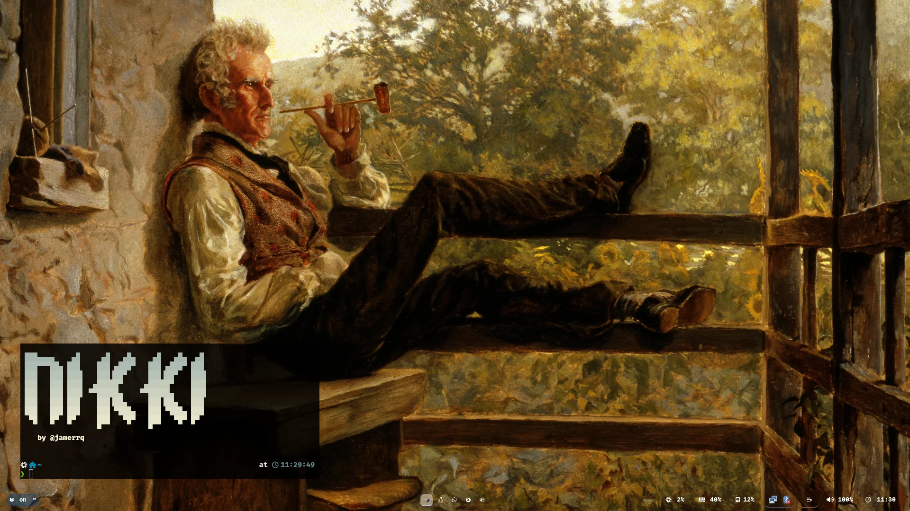

# Nikki (NixOS)

NixOS dotfiles by [@jamerrq](https://github.com/jamerrq)

### config files

- [cava](.config/cava)
- [fastfetch](.config/fastfetch)
- [kitty](.config/kitty)
- [mako](.config/mako)
- [neovim](.config/nvim)
- [sherlock launcher](.config/sherlock)
- [sway](.config/sway)
- [waybar](.config/waybar)
- [zsh](.config/zsh)

### utility bash scripts

- [dev/scripts/bash](dev/scripts/bash/)

### wallpapers

- [pictures/webp_wallpapers.zip](pictures/webp_wallpapers.zip)
- [pictures/background.png](pictures/background.png)

### icons

- [pictures/nikki/icons](pictures/nikki/icons)

### nixos files

- [configuration.nix](nikki/configuration.nix)
- [hardware-configuration.nix](nikki/hardware-configuration.nix)

### screenshots

