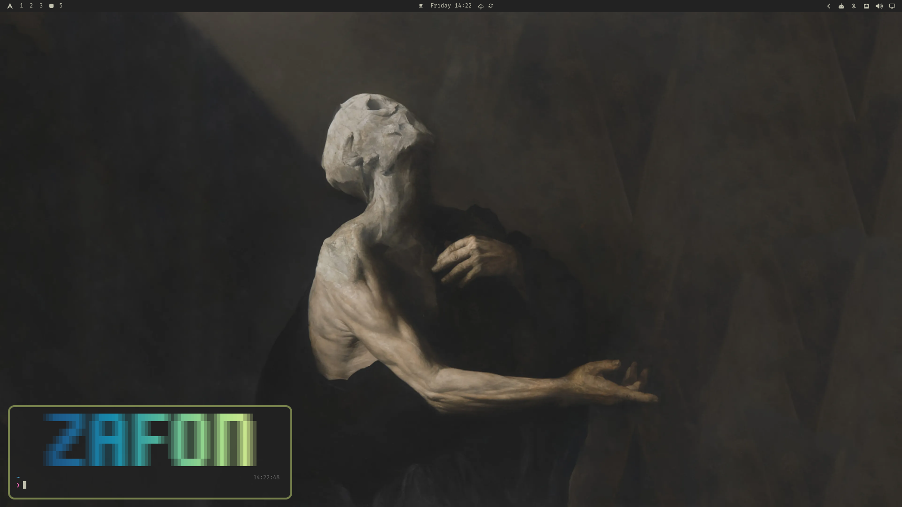

# Zafon - Capablanca

[](./README.md)
[](./README.es.md)

> [!WARNING]
> don't use this, this is some ai slop generated stuff for my machine
> you probably don't need all of this
> in case you want to use any of this, it's up to your consideration

## My [Omarchy](https://omarchy.org/) customizations

- Rounded borders for walker, mako, and hyprland (10px)
- Thicker borders for hyprland and mako (size 4)
- Persistent custom wallpapers mapped natively into theme's backgrounds folder
- Use Arch Linux logo (`󰣇`) on the waybar and fastfetch
- System-wide enforcement of `FiraCode Nerd Font`
- Neovim `ColorColumn` visibility fix (`#1e6091`) + `unnamedplus` clipboard sync
- Keyboard layout input set to `latam`
- Custom monitor workspace navigation mimicking i3 behavior

## Quick Setup (New Machine)

To quickly deploy these dotfiles and apply all Omarchy customizations on a new machine, run:

```bash
yadm clone https://github.com/jamerrq/zafon -b capablanca
yadm bootstrap
```

`yadm bootstrap` runs [zafon](#zafon) non-interactively, which applies every
customization except the ones marked optional (those need sudo). Afterwards:

```bash
zafon check     # verify everything landed
zafon apply     # pick up the optional steps
```

Log out and back in once, so `~/.local/bin` takes effect for everything
Hyprland launches.

## Zafon

`zafon` is the CLI that applies and verifies these customizations. Each concern
is a module in `~/.config/yadm/zafon.d/`; `check` is strictly read-only, so it
is safe to run any time — including before an `omarchy-update`.

```
zafon                       # default: walk each problem and confirm before fixing
zafon check                 # report drift, change nothing
zafon apply --yes           # unattended; skips optional (sudo) modules
zafon check --only waybar   # scope to one module
zafon list                  # show all modules
zafon tree                  # every tracked file as a tree
```

Exit codes: `0` all good, `1` drift remains or a module failed, `3` usage error.

| Module | Covers |
| --- | --- |
| `hypr` | `nikki.conf` sourced from `hyprland.conf`, keybound helper scripts |
| `waybar` | config, style and custom scripts — yadm is the source of truth |
| `omarchy-bin` | patched Omarchy scripts shadowing the clone via `~/.local/bin` |
| `zsh` | omz, powerlevel10k and custom plugins (cloned, not tracked) |
| `theme` | rounded mako/walker templates, FiraCode, custom wallpapers |
| `system` | root-owned units (ACPI wakeup fix) — optional, needs sudo |
| `wallpaper` | offers the tux wallpaper as a last step — optional, declining keeps yours |

### How the Omarchy overrides work

`~/.local/share/omarchy` is a git checkout of upstream Omarchy, so editing
scripts in place means `omarchy-update` clobbers them. Patched copies live in
`~/.config/yadm/omarchy/bin/` and are symlinked into `~/.local/bin`, which
`~/.config/environment.d/10-zafon-path.conf` puts ahead of Omarchy's `bin` on
the systemd user PATH. The clone stays pristine.

### ACPI wakeup

Some devices (`XHCI`, `RP09`, `RP10`, `RP05`, `AWAC`) spuriously wake this
machine from suspend. `/proc/acpi/wakeup` is runtime state that resets to the
firmware defaults on every boot, so the fix has to be re-applied each time; a
oneshot systemd unit does that at startup.

```bash
# needs sudo, also run by `zafon apply`
~/.config/yadm/system/install.sh
systemctl status disable-acpi-wakeup
```

Writing a device name to `/proc/acpi/wakeup` *toggles* it, so the script guards
on `*enabled` before each write — without that guard, re-running it would
re-arm everything it just disabled.

## Requirements

Beyond a working Omarchy install:

```bash
yay -S yadm gum jq playerctl brightnessctl ddcutil scrcpy
```

- `yadm` — dotfile tracking
- `gum` — zafon's interactive menu (falls back to plain prompts if absent)
- `jq`, `playerctl` — waybar spotify module and audio switching
- `brightnessctl`, `ddcutil` — brightness, including external monitors over DDC/CI
- `scrcpy` — android screen mirroring

## Snaps



More info:

- [omarchy.org](https://omarchy.org/)
- [Source code on GitHub](https://github.com/basecamp/omarchy)
