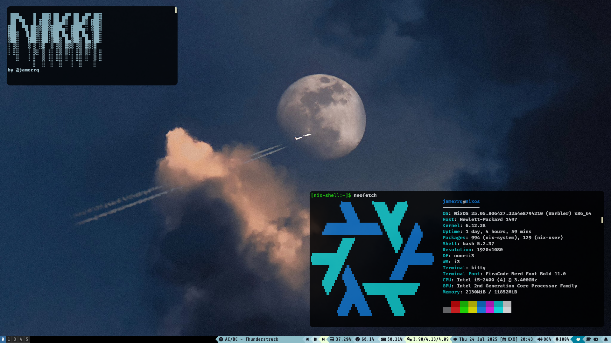
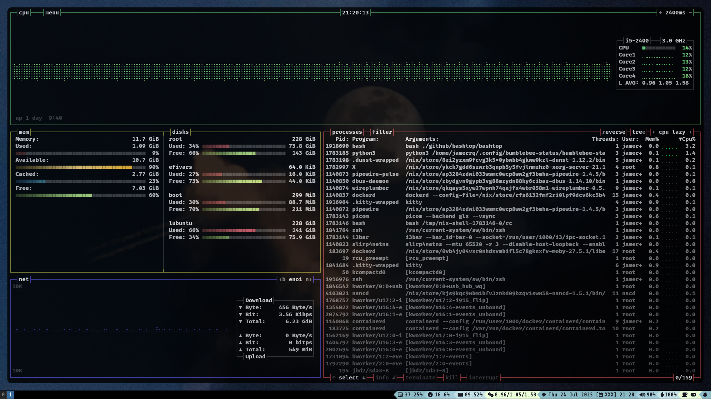
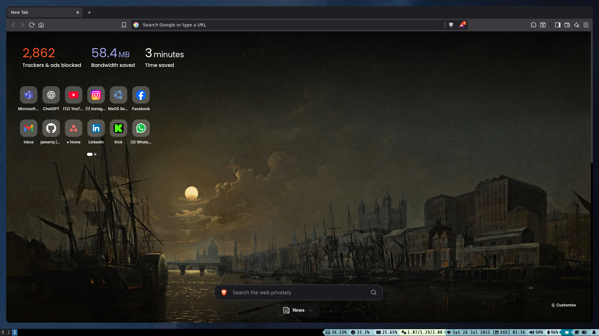
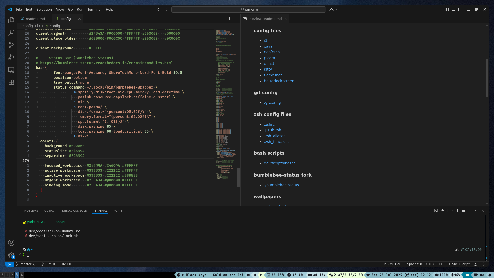

# Nikki (NixOS)

NixOS configuration by [@jamerrq](https://github.com/jamerrq)

### config files

- [i3](.config/i3)
- [cava](.config/cava)
- [neofetch](.config/neofetch)
- [picom](.config/picom)
- [dunst](.config/dunst)
- [kitty](.config/kitty)
- [flameshot](.config/flameshot)
- [betterlockscreen](.config/betterlockscreen)

### git config
- [.gitconfig](.gitconfig)

### zsh config files

- [.zshrc](.zshrc)
- [.p10k.zsh](.p10k.zsh)
- [.zsh_aliases](.zsh_aliases)
- [.zsh_functions](.zsh_functions)

### utility bash scripts

- [dev/scripts/bash/](dev/scripts/bash/)

### bumblebee-status fork

- [./bumblebee-status](.config/bumblebee-status)

### wallpapers

- [pictures/webp_wallpapers.zip](pictures/webp_wallpapers.zip)
- [pictures/background.png](pictures/background.png)

### icons

- [pictures/icons](pictures/icons)

### nikki files

- [configuration.nix](nikki/configuration.nix)
- [hardware-configuration.nix](nikki/hardware-configuration.nix)

### screenshots

