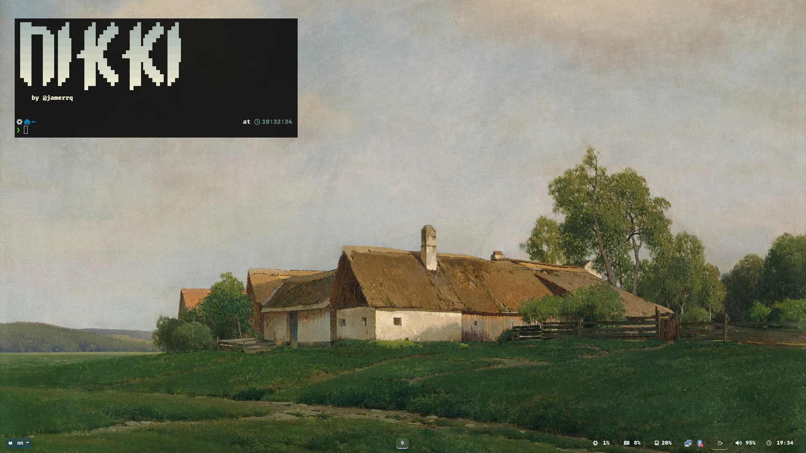
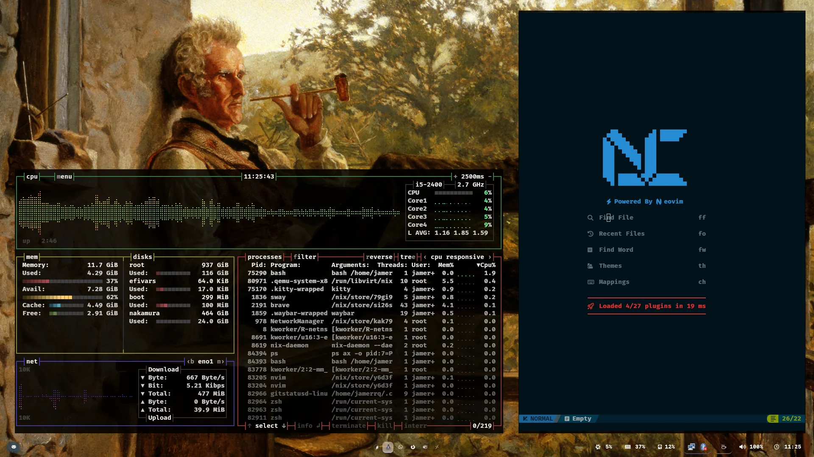
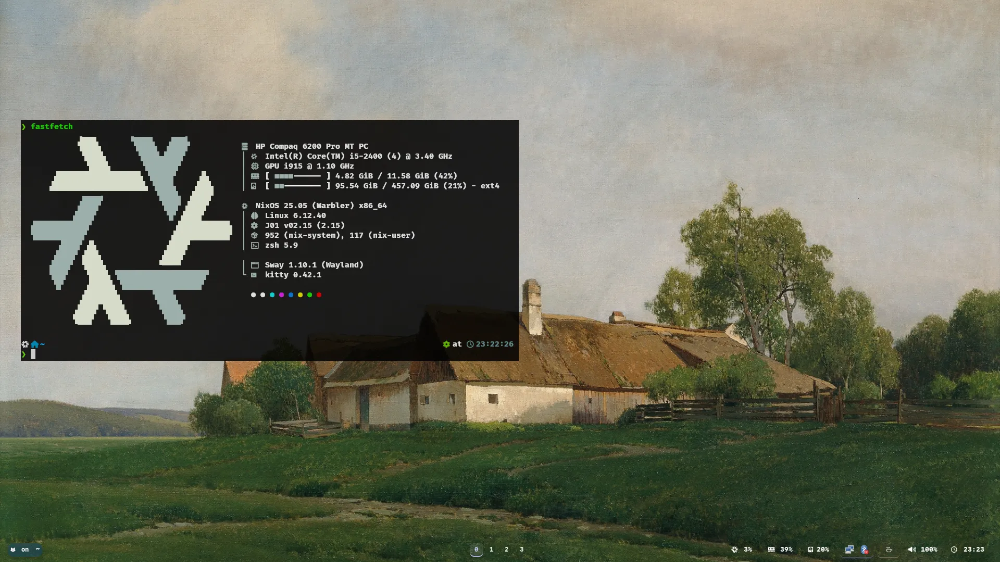
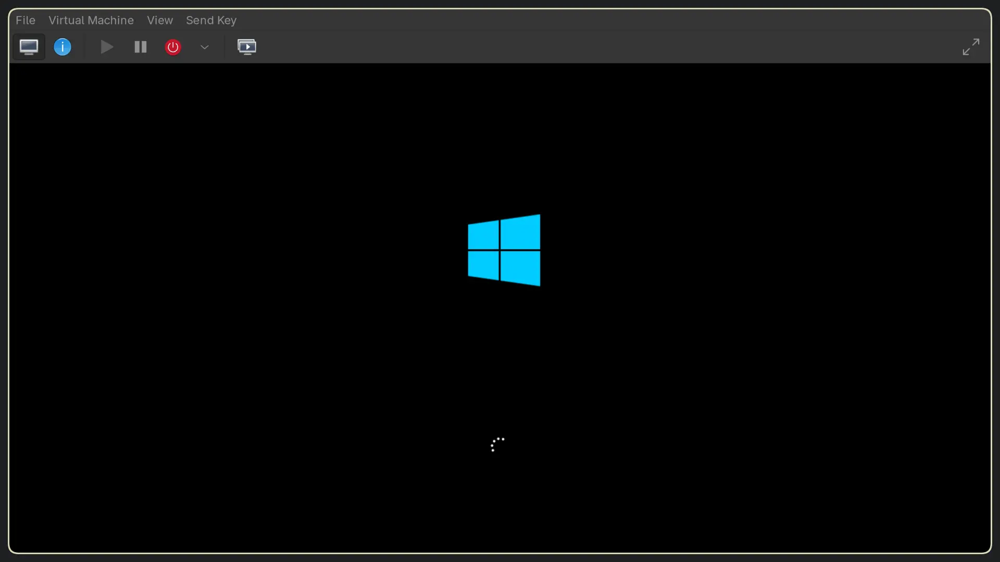

# Omarchy - Nikki

found my home, thanks dhh

## My [omarchy](https://omarchy.org/) customizations

- [zsh](.config/zsh/)
- [lazyvim](.config/nvim/)
- [waybar](.config/waybar/)
- [mako](.config/mako/)
- [hyprland](.config/hyprland)
- [cava](.config/cava/)

## Snaps

More info:

- [omarchy.org](https://omarchy.org/)
- [Source code on GitHub](https://github.com/basecamp/omarchy)
